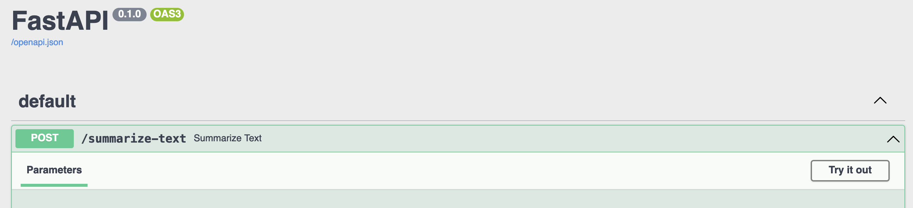

# LLM-API-starterkit

For a step-by-step guide and more context, please look at my blog post: https://blog.timleers.com/a-stupidly-minimal-llm-api-starterkit-deploy-llm-endpoints-in-a-minute-with-langchain-and-fastapi

This repository is the most minimal implementation of an LLM API possible, focusing on making this technology accessible to coders new to LLMs & APIs. The core libraries are `langchain` & `fastapi`. 

For an example that is more comprehensive and adhering to best practices, I will soon share more examples.
  * Minimal guide to serverless deployment without Ops: https://github.com/tleers/minimal-serverless-llm-deployment
  * [TODO] A comprehensive, best practices guide with Ops: https://github.com/tleers/servelm

# Quick-start

There's three steps to starting the demo or doing development on this template.

1. Installation of general python package requirements/dependencies
2. Selection of LLM model & dependencies
3. Running the FastAPI application

## 1. Installation of dependencies

We use the most common way of installing dependencies, which is using `pip install` with a requirements.txt.

Tutorial was created using `Python 3.10`.

```bash
pip install -r requirements.txt
```

It is advised to at the very least install these requirements in a virtual environment. To create a virtual environment and install the requirements there, use the following:
```bash
python3 -m venv venv
. venv/bin/activate
pip install -r requirements.txt
```

Ideally, we use dependency management with `poetry` for a smoother experience (see https://github.com/tleers/minimal-serverless-llm-deployment for an example). We ignore this additional complexity for now in this example.

## 2. LLM model preparation

### 2.1 **With an OpenAI key**

1. Change the filename of .env.example to .env
2. Add your OpenAI API key to .env

Done.

### 2.2 **Without an OpenAI key**

Note that you need sufficiently powerful hardware to run a local model. It's easier to use the OpenAI API if you're initially experimenting. Making an account means you get free credits, which are usually more than you need.

#### **X86-64 architectures (Windows, Linux, non-Apple silicon Mac)**
We use LlamaCpp. 
https://python.langchain.com/en/latest/modules/models/llms/integrations/llamacpp.html

1. Download model weights that are compatible with the llamacpp implementation. 
I use vicuna 1.1 quantized https://huggingface.co/vicuna/ggml-vicuna-7b-1.1/blob/main/ggml-vic7b-uncensored-q4_0.bin, as recommended on https://old.reddit.com/r/LocalLLaMA/wiki/models

2. Make sure the model weights are in the current directory and you know the filename. 
In this tutorial, the filename is `ggml-vic7b-uncensored-q4_0.bins`

#### **ARM64 architectures or M1/M2 Mac**
LangChain support for LLamaCpp is currently iffy on Apple Silicon. Therefore, we instead use the GPT4ALL integration.
Download the model file here:


1. Download model weights from https://gpt4all.io/index.html
There are many different ones available, take a look at what best fits your usecase. I use
"ggml-gpt4all-j-v1.3-groovy.bin"

2. Make sure the model weights are in the current directory and you know the filename. 
In this tutorial, the filename is `ggml-gpt4all-j-v1.3-groovy.bin`


## 3. Running the FastAPI application

You should be ready to run the most basic example.

With OpenAI API
```bash
uvicorn app.main_openai:app --port 80 --env-file .env
```

With local LLM using Vicuna, compatible with X86_64 architecture
```bash
uvicorn app.main_local_lamacpp:app --port 80
```

With local LLM using GPT4All, compatible with X86_64 as well as arch_64 (mac m1, m2) architectures.
```bash
uvicorn app.main_local_gpt_4_all:app --port 80
```

Go to `https://localhost:80/docs` to see the automatically generated API documentation. 

You can also try out the summarization endpoint by clicking `Try it out!`



